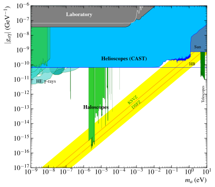
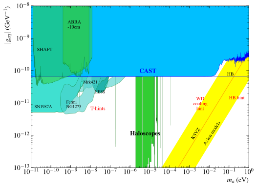
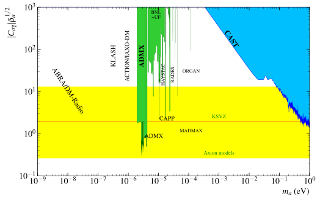

# iaxo-axion-limits
IAXO Axion Limits

# Files description
The main files where the code is written are
1. XPlotter.py : the matplotlib.pyplot objects creation and configuration are handled within the two classes (BasePlot and ExPltItem) defined in this file
2. AxionPlot.py : the creation of the BasePlot for the two cases (AxionGagPlot and AxionGaePlot), the plotting of the data and labels are handled within this classes. The plotting of the data and labes is done through the DataBase classes defined in the following file.
3. DataBaseClass.py : Here the DataBase classes are defined to interface with the SQLite .db files. It has the following classes:
   - DataBase : is not intended to be used, just serve to be inherited by the other classes.
   - DataBaseGag for the database table of AxionGag experiments.
   - DataBaseGae for the database table of AxionGae experiments.
   - DataBaseLabels for the database table of labels (for both AxionGag and AxionGae plots).
This files are not intended to be modified by the user.

The files that are meant to be modified and used by the user are the following:
1. buildDataBase.py : this is an example of the building of the database .db files. It also serves as backup to be able to recreate the Axions.db in case this one is lost or edited unintentionally.
2. example.py : this is the main file to be handled by the user to make the desired plot. Here load (and edit if you want) the database tables and call the corresponding AxionPlot constructor to make the plot.

# Directories description
1. Javat : all needed files (html and java) for the labels app.
2. data : here the .txt or .dat files with the exclusion lines of the different experiments should be stored.
3. databases : here the .db files with the databases of the experiments data and labels should be stored. Include here any new database you build to make a new plot you may want to reproduce in the future.
4. plots : here the saved plots should be stored. The relative path to this directory is added automatically to the plotname specified by the user.

# Basic Plot
---
[](https://github.com/DanielMartinezMiravete/Axion_Limits_Memory/blob/main/Javat/plots/Labeled/AxionPhoton_large_panoramalabeled.svg)

## Basic plot without proyections

### [Download (.pdf)](https://github.com/DanielMartinezMiravete/Axion_Limits_Memory/blob/main/Javat/plots/Labeled/AxionPhoton_large_panoramalabeled.pdf)
### [Download (.png)](https://github.com/DanielMartinezMiravete/Axion_Limits_Memory/blob/main/Javat/plots/Labeled/AxionPhoton_large_panorama.png)
### [Download (.svg)](https://github.com/DanielMartinezMiravete/Axion_Limits_Memory/blob/main/Javat/plots/Labeled/AxionPhoton_large_panorama.svg)

### &nbsp;

# Close up General Plot
---
[](https://github.com/DanielMartinezMiravete/Axion_Limits_Memory/blob/main/Javat/plots/Labeled/AxionPhoton_panoramalabeled.svg)

## Close up General plot without proyections

### [Download (.pdf)](https://github.com/DanielMartinezMiravete/Axion_Limits_Memory/blob/main/Javat/plots/Labeled/AxionPhoton_panoramalabeled.pdf)
### [Download (.png)](https://github.com/DanielMartinezMiravete/Axion_Limits_Memory/blob/main/Javat/plots/Labeled/AxionPhoton_panorama.png)
### [Download (.svg)](https://github.com/DanielMartinezMiravete/Axion_Limits_Memory/blob/main/Javat/plots/Labeled/AxionPhoton_panorama.svg)

### &nbsp;

# Close up Helioscopes Plot
---
[](https://github.com/DanielMartinezMiravete/Axion_Limits_Memory/blob/main/Javat/plots/Labeled/AxionPhoton_helioscopes.svg)

## Close up Helioscopes plot without proyections

### [Download (.pdf)](https://github.com/DanielMartinezMiravete/Axion_Limits_Memory/blob/main/Javat/plots/Labeled/AxionPhoton_helioscopeslabeled.pdf)
### [Download (.png)](https://github.com/DanielMartinezMiravete/Axion_Limits_Memory/blob/main/Javat/plots/Labeled/AxionPhoton_helioscopes.png)
### [Download (.svg)](https://github.com/DanielMartinezMiravete/Axion_Limits_Memory/blob/main/Javat/plots/Labeled/AxionPhoton_helioscopes.svg)

### &nbsp;
# Close up Halocopes Plot
---
[](https://github.com/DanielMartinezMiravete/Axion_limts_Mermory/blob/main/Javat/plots/Labeled/AxionPhoton_haloscopes.svg)

## Close up Haloscopes plot without proyections

### [Download (.pdf)](https://github.com/DanielMartinezMiravete/Axion_Limits_Memory/blob/main/Javat/plots/Labeled/AxionPhoton_haloscopeslabeled.pdf)
### [Download (.png)](https://github.com/DanielMartinezMiravete/Axion_Limits_Memory/blob/main/Javat/plots/Labeled/AxionPhoton_haloscopes.png) 
### [Download (.svg)](https://github.com/DanielMartinezMiravete/Axion_Limits_Memory/blob/main/Javat/plots/Labeled/AxionPhoton_haloscopes.svg)
For the haloscopes, there are additional graphs zooming in on different areas.
### &nbsp;

---

## Getting Started

To recreate these images, we need to execute the Python script called "example.py" as follows:
```
python3 example.py
```
This will plot the large_panorama plottype of graphs (without their projections). To generate another plottype or include the projections, we should modify the plottype variable to the desired one. Also you can add the projections by the "projections" parameter in AxionGagPlot constructor and set it to True.

To quickly add new labels to the plots in a easy way (although this would not be saved anywhere to be reproduced) you may use the labels app programmed in the Javat directory. Or just click on the following link: 
[Label's APP](https://danielmartinezmiravete.github.io/Labels-App/)

You can start the app by opening the HTML script called 'index.html'. This application is only capable of modifying SVG files. Instructions for the webpage are provided within the webpage itself.

As additional information, to interact with the database, you need to use different functions implemented in the script called 'DataBaseGag.py'.
This repository contains Python scripts for interacting with the AxionsGag database. The database is used to manage information about various experiments related to axion research. Below, you'll find instructions on how to use the provided functions to work with the database.

## Handling the databases
### Loading a database
To load the desired database use the constructor of the classes DataBaseGag (for AxionGag experiments), DataBaseGae (for AxionGae experiments) or DataBaseLabels (for the labels) as follows:
```
import DataBaseClass as db

# Load the desired database. The first parameter is the path to the .db file and second parameter is the name of the database table inside that .db file.
database = db.DataBaseGag("databases/Axions.db", "AxionsGag") # load table AxionsGag of Gag experiments from the database file databases/Axions.db
labels = db.DataBaseLabels("databases/Axions.db", "large_panorama") # load table large_panorama of labeles from the database file databases/Axions.db
````

Once loaded, you can edit the database if you want. Note that the database file will be edited too. 
For example, you can add a new row with the following command:
```
database.insert_row("exp_name", "line", "path_to_datafile", "color='red', linewidth=2", 1, 0, 0, 0, 0, 0, 0)
```
Or change the drawOptions of a row:
```
database.update_row("exp_name", "drawOptions", "color='blue', linewidth=1")
```
Or change if it is drawn in the large panorama plot: (1 for yes, 0 for no)
```
database.update_row("exp_name", "large_panorama", 1)
```
Or delete a row:
```
database.delete_rows("name='exp_name'") # set parameter confirm=True to avoid the security check
```
### Creating a new database
To create a new database for a new plot you may follow this examples. Keep in mind that the order in which the experiments are added to the database will be the order in which they are plotted, so the last experiments added will be drawn o top of the firsts experiments added to the database.
For a Gag exclusion plot:
```
import DataBaseClass as db
database = db.DataBaseGag("databases/NewAxions.db") # this will create (if it doesnt already exists) a table named AxionsGag (default) at databases/NewAxions.db
AxionsGag = [
    ['qcdband', 'band', PATH_DATA + 'QCD_band.dat', "facecolor='yellow'", 1, 0, 0, 0, 0, 0, 0],
    ['old_haloscopes', 'band', PATH_DATA + 'MicrowaveCavities.txt', "facecolor='limegreen', edgecolor='darkgreen', linewidth=0.2", 1, 0, 0, 0, 0, 0, 0],
    ['ABRA3', 'line', PATH_DATA + 'ABRAres_3.dat', "color='green', linewidth=0.1, linestyle='-'", 1, 0, 0, 0, 0, 0, 0],
    ['ADMX2018', 'band', PATH_DATA + 'ADMX2018.txt', "facecolor='limegreen', edgecolor='darkgreen', linewidth=0.2", 1, 0, 0, 0, 0, 0, 0],
    ['BabyIAXO', 'band', PATH_DATA + 'miniIAXO.dat', "facecolor='deepskyblue', linewidth=0.5, alpha=0.1, linestyle='-'", 1, 0, 0, 0, 0, 0, 0],
    ['IAXO', 'band', PATH_DATA + 'IAXO_nominal.txt', "facecolor='deepskyblue', linewidth=0.5, alpha=0.1, linestyle='-'", 1, 0, 0, 0, 0, 0, 0],
    ['CAST', 'band', PATH_DATA + 'cast_env_2016.dat', "facecolor='deepskyblue', edgecolor='blue', linewidth=0.5", 1, 0, 0, 0, 0, 0, 0],
]
database.insert_rows(AxionsGag) 
data = database.read_rows()
print(data)
```
For a Gae exclusion plot:
```
import DataBaseClass as db
database = db.DataBaseGae("databses/NewAxions.db")  # this will create (if it doesnt already exists) a table named AxionsGae (default) at databases/NewAxions.db
AxionsGae= [
    ["DFSZ1_starhint", "region", path1 + "DFSZ1_ABC_dominant_No_SN_2sigma_hint_rootgaegag_vs_ma.dat", "facecolor='springgreen', edgecolor='darkgreen', alpha=0.2", 1, 0],
    ["AJ83_starhint", "region", path1 + "AJ83_ABC_dominant_No_SN_2sigma_hint_rootgaegag_vs_ma.dat", "facecolor='red', edgecolor='red', alpha=0.2", 1, 0],
    ["QCDband", "band", path2 + "DFSZband_gaegag.dat", "facecolor='lemonchiffon', edgecolor='none', linewidth=1", 1, 0],
    ["CAST_gae", "band", path2 + "CAST_gae_gagg.dat", "facecolor='steelblue', edgecolor='darkblue', linewidth=0.5", 1, 0],

    ["IAXO_gae", "band", path2 + "sqrtgaagae_sc2.dat", "facecolor='skyblue', edgecolor='black', linewidth=0.5, alpha=0.3", 0, 1],
    ["IAXOplus_gae", "band", path2 + "sqrtgaagae_sc3.dat", "facecolor='skyblue', edgecolor='black', linewidth=0.5, alpha=0.3", 0, 1],
]
database.insert_rows(AxionsGae)
data = database.read_rows()
print(data)
```
For the labels:
```
import DataBaseClass as db
database = db.DataBaseLabels("databases/NewAxions.db") # this will create (if it doesnt already exists) a table named Labels (default) at databases/NewAxions.db
labels = [
    ["CAST", 2.0e-4, 1.2e-11, "color='white', fontsize=12", 1, 0],
    ["IAXO", 2.0e-4, 6.0e-13, "color='black', fontsize=12", 1, 1],
]
database.insert_rows(labels)
data = database.read_rows()
print(data)
```

## Known Issues
- The order in which the experiments are added to the database will be the order in which they are plotted, so the last experiments added will be drawn o top of the firsts experiments added to the database. Maybe the value of the plottype column of the databases should be used to also select thhe zorder in which they are drawn ?
- The labels application cannot interpret LaTeX.
- At labels application, when working with multiple labels, moving a label other than the last label will replace the coordinates of the last label written.

## Acknowledgement
The original code is https://github.com/iaxo/axion-limits/

Modified by Daniel Martínez Miravete in his summer internship (https://github.com/DanielMartinezMiravete/Axion_Limits_Memory) for the Physics Bachelor within the IAXO group of GIFNA (Unizar). Internship supervised by Juan Antonio García Pascual and Álvaro Ezquerro Sastre. Also, very helpfull insight was given by David Díez Ibáñez and Luis Obis Aparicio.

